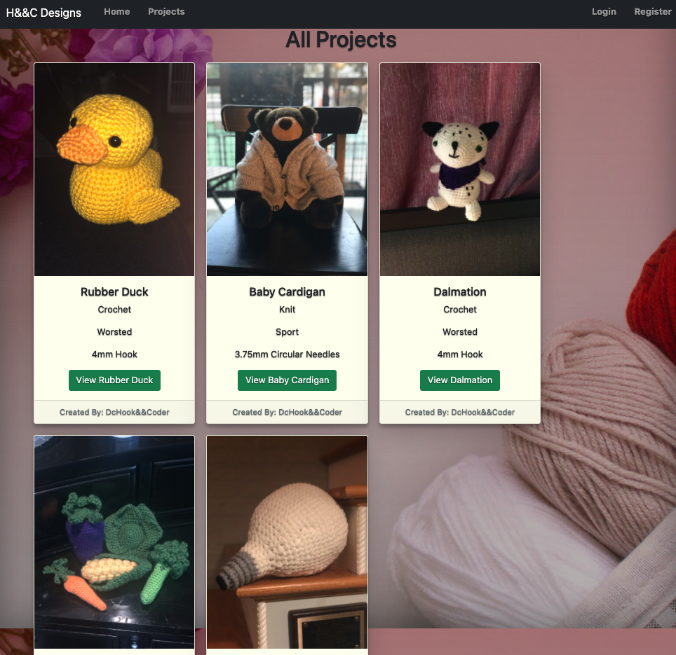

# dcHooknCoderDesigns

* [DEPLOYED PROJECT](https://dc-hook-n-coder-designs.herokuapp.com/)

* [TRELLO BOARD: KANBAN STYLE](https://trello.com/b/6PteyvaW/dc-hook-coder-designs)

* [GITHUB REPO](https://github.com/dcbeergoddess/dcHooknCoderDesigns)

## Description

Beginnings of CRUD App for my craft yarn projects and more. First instance of the application to is showcase crochet and knit projects I have finished based of other people's patterns and allow users to comment. 

Next up is to create an inventory page for all my yarn in stock. 

Eventually I will allow others to add their own projects and have their own project page.

## Table Of Contents

* [Tech Stack](#techstack)
* [User Story](#userstory)
* [Screenshots](#screenshots)
* [Collaborators](#collaborators)
* [New Technology](#newtechnologyresources)
* [License](#license)

## Tech Stack
* JavaScript
* HTML
* CSS
* Bootstrap
* Node.JS
* Express
* MongoDB
* EJS
* Passport.JS
* Heroku

## User Story
* Any user can view the site and see projects and other index level pages but cannot comment or engage with any other part of the application
* User that is logged in as Admin can add, delete, and update Projects on the main index page
* Users that sign up with username, email, and password can comment on projects and delete their own comments

## Screenshots
- 
- 
- 

## Collaborators
* **Rachel Murray** |  | [@rachel](https://github.com/dcbeergoddess) | 

## Technology Resources

* [EJS-MATE PACKAGE](https://github.com/JacksonTian/ejs-mate)
* [JOI DOCS](https://joi.dev/api/?v=17.2.1)
* [Mongo Blog on Design Part 3](https://www.mongodb.com/blog/post/6-rules-of-thumb-for-mongodb-schema-design-part-3)
* [Mongo Blog on Design Part 2](https://www.mongodb.com/blog/post/6-rules-of-thumb-for-mongodb-schema-design-part-2)
* [Mongoose Middleware](https://mongoosejs.com/docs/middleware.html)
* [Passport Docs](http://www.passportjs.org/)
* [Passport-Local](https://github.com/jaredhanson/passport-local)
* [Passport-Local-Mongoose](https://github.com/saintedlama/passport-local-mongoose)
* [Multer Docs](https://github.com/expressjs/multer)
* [CLOUDINARY HOMEPAGE](https://cloudinary.com/)
* [MULTER STORAGE CLOUDINARY DOCS](https://github.com/affanshahid/multer-storage-cloudinary/blob/master/README.md)
* [Cloudinary Image Transformations](https://cloudinary.com/documentation/image_transformations)
* [Express Mongo Sanitize Package](https://www.npmjs.com/package/express-mongo-sanitize)
* [Sanitize HTML Package](https://www.npmjs.com/package/sanitize-html)
* [Helment Docs](https://helmetjs.github.io/)
* [Mongo Cloud](https://www.mongodb.com/cloud)
* [Connect-Mongo Package](https://www.npmjs.com/package/connect-mongo)
* [Heroku](https://www.heroku.com/)

## License

MIT License

Copyright (c) [2021] [Rachel Murray]

Permission is hereby granted, free of charge, to any person obtaining a copy
of this software and associated documentation files (the "Software"), to deal
in the Software without restriction, including without limitation the rights
to use, copy, modify, merge, publish, distribute, sublicense, and/or sell
copies of the Software, and to permit persons to whom the Software is
furnished to do so, subject to the following conditions:

The above copyright notice and this permission notice shall be included in all
copies or substantial portions of the Software.

THE SOFTWARE IS PROVIDED "AS IS", WITHOUT WARRANTY OF ANY KIND, EXPRESS OR
IMPLIED, INCLUDING BUT NOT LIMITED TO THE WARRANTIES OF MERCHANTABILITY,
FITNESS FOR A PARTICULAR PURPOSE AND NONINFRINGEMENT. IN NO EVENT SHALL THE
AUTHORS OR COPYRIGHT HOLDERS BE LIABLE FOR ANY CLAIM, DAMAGES OR OTHER
LIABILITY, WHETHER IN AN ACTION OF CONTRACT, TORT OR OTHERWISE, ARISING FROM,
OUT OF OR IN CONNECTION WITH THE SOFTWARE OR THE USE OR OTHER DEALINGS IN THE
SOFTWARE.

